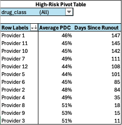

# Medication Adherence Reporting

**Measurement period:** 2025-07-01 to 2025-12-31 (184 days)  
**Focus:** Statins, HTN meds, Diabetes meds  
**Database:** SQLite (`med_adherence.db`)

## Overview
This project analyzes pharmacy refill data to assess medication adherence using
**Proportion of Days Covered (PDC)** and summarizes the results in an Excel dashboard.

The intent is to provide a simple reporting view that helps providers and care teams
identify patients who may be at risk for non-adherence and prioritize follow-up.

## Dashboard Preview

## High-Risk Patient View

## Adherence Definitions
- **PDC (Proportion of Days Covered)**  
  Covered medication days divided by total days in the measurement period

- **Adherent:** PDC ≥ 80%  
- **Moderate Risk:** PDC 60–79%  
- **High Risk:** PDC < 60%

These thresholds are consistent with commonly used quality and population health standards.

## What This Project Produces
This type of reporting is commonly used in population health and medication therapy management programs to support targeted outreach.

## How to Run
1. Open `med_adherence.db` using SQLite or DBeaver
2. Execute SQL scripts in the `sql/` folder
3. Export results to CSV
4. Open `adherence_dashboard.xlsx` to view the dashboard

## Limitations
- Data is synthetic and does not reflect real patient behavior
- Medication changes, therapy discontinuation, and switching are not modeled
- Adherence is inferred from refill data and does not confirm actual medication use
- Outreach outcomes and post-intervention adherence are not tracked

